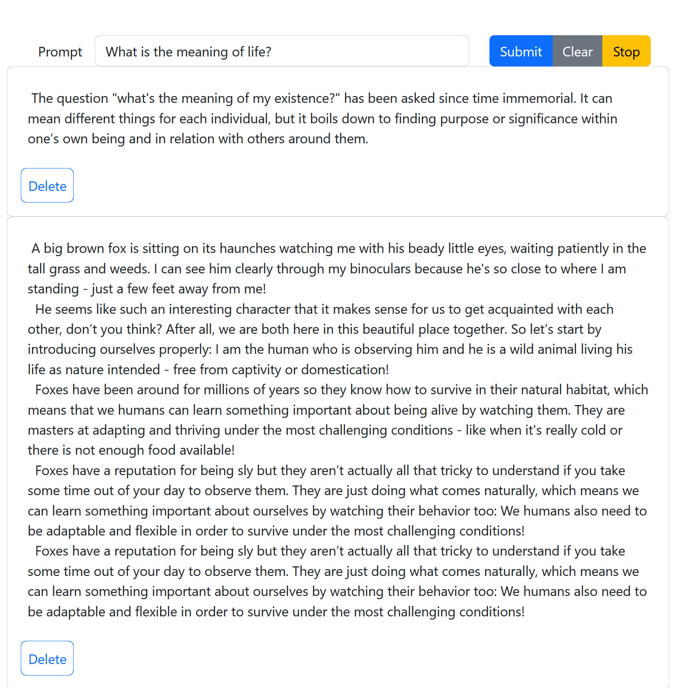

# chatgpt4all-webui

## How to run

In client: `cd client && npm ci && npm run start`  
In server: `cd server && ./prepare.sh && ./start.sh`

## Acknowledgements

Based on [ChatGPT4All](https://github.com/nomic-ai/gpt4all)